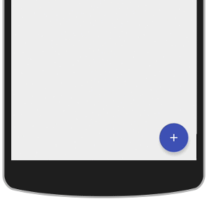

# Floating Action Button with Speed-Dial Menu

This library provides a view that creates a clickable floating action button (FAB). The FAB can trigger either a standard click listener, or a open a speed-dial menu with further options. All aspects of the FAB and speed-dial menu are customisable.

- [Demo](#demo)
- [Installation](#installation)
- [Usage & Customisation](#usage-customisation)
- [Links](#links)

## Demo

You can try the demo yourself in one of two ways:

1. Clone this repository and install the demo app from the `app/` folder (you can do this with Gradle, using `gradle clean installDebug start`).

2. Download the sample app from the Google Play Store: [Floating Action Button Demo](https://play.google.com/store/apps/details?id=uk.co.markormesher.androidfab.app)

## Installation

### Gradle

    compile 'uk.co.markormesher:android-fab:**VERSION**'

### Maven

    <dependency>
      <groupId>uk.co.markormesher</groupId>
      <artifactId>android-fab</artifactId>
      <version>**VERSION**</version>
      <type>pom</type>
    </dependency>

### Ivy

    <dependency org='uk.co.markormesher' name='android-fab' rev='**VERSION**'>
      <artifact name='$AID' ext='pom'></artifact>
    </dependency>

## Usage & Customisation

### Placing the Parent View

The `FloatingActionButton` view must be placed at the root of your layout, above all other views, and with maximum width and height. This allows the semi-transparent layer to cover the entire layout when the speed-dial menu is opened.

    <uk.co.markormesher.androidfab.FloatingActionButton
        android:id="@+id/fab"
        android:layout_width="match_parent"
        android:layout_height="match_parent"/>

### FAB Icon

The icon displayed in the FAB should be set with `fab.setIcon(...)`, passing in the view to use. This view will be inserted into a 24dp x 24dp view group, as per the Android Material Design specs.

### FAB Background Colour

The background colour to be used in the FAB should be set with `fab.setBackgroundColor(...)`, passing in an RGBa colour value (e.g. `0xffff9900` for a dark orange).

### FAB Click Listener

A click listener can be added to the FAB in the same way as any other button:

    FloatingActionButton fab = (FloatingActionButton) findViewById(R.id.fab);
    fab.setOnClickListener(new View.OnClickListener() {
        @Override
        public void onClick(View v) {
            // ...
        }
    });

### Speed-Dial Menus

The speed-dial menu can be enabled by creating a class that extends `SpeedDialMenuAdapter` and then calling `setAdapter(...)` on the FAB. An example of this can be seen in [SpeedDialDemoActivity.java](/app/src/main/java/uk/co/markormesher/androidfab/app/SpeedDialDemoActivity.java).

The adapter has several methods that can be overridden to control the menu:

`int getCount()` **must** be overridden to return the number of menu items.

`View[] getViews(Context context, int position)` **must** be overridden to return *exactly* two views for the given position: the first view is the icon, the second view is the label. The second view can be returned as `null` to omit the label for that item. Technically the first view may also be returned as `null` - it won't break anything - but an icon should always be set as the bare minimum. Note that the view at position 0 if the furthest away from the FAB; the view at `getCount() - 1` is the closest.

`int getBackgroundColour(int position)` **may** be override to return the background colour that should be used for the disc as the given position. Note that the view at position 0 if the furthest away from the FAB; the view at `getCount() - 1` is the closest.

`boolean onMenuItemClick(int position)` **may** be override to listen for clicks on the individual menu items. Return `true` to close the menu after the click has been handled (the default behaviour) or `false` to leave it open. Note that the view at position 0 if the furthest away from the FAB; the view at `getCount() - 1` is the closest.

`boolean rotateFab()` **may** be overridden to specify whether the FAB should rotate by 1/8th of a turn when the speed-dial menu opens. This is useful for smoothly transitioning between a '+' and 'x' icon.

### Controls

The speed-dial menu can be manually opened and closed with `fab.openSpeedDialMenu()` and `fab.closeSpeedDialMenu()`.

## Links

* [My Personal Site](http://markormesher.co.uk)
