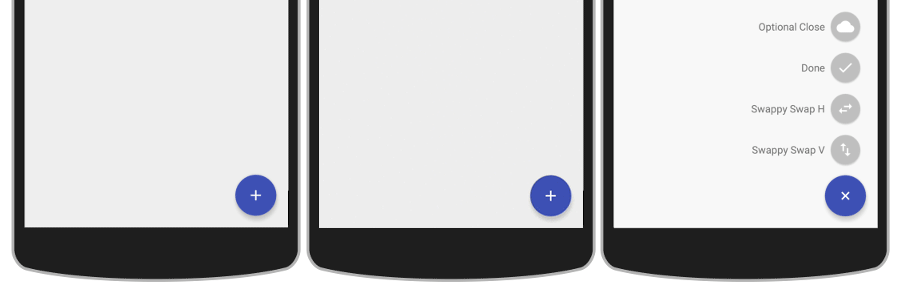

# Floating Action Button with Speed-Dial Menu

This library provides a view that creates a clickable floating action button (FAB). The FAB can trigger either a standard click listener, or a open a speed-dial menu with further options. All aspects of the FAB and speed-dial menu are customisable.

## Demo

You can try the demo yourself in one of two ways:

1. Clone this repository and install the demo app from the `app/` folder (you can do this with Gradle, using `gradle clean installDebug start`).

2. Download the sample app from the Google Play Store: [Android FAB Sample](https://play.google.com/store/apps/details?id=uk.co.markormesher.androidfab.app)

## Usage

[Click here for documentation.](docs)

## Links

* [Documentation](docs)
* [My Personal Site](http://markormesher.co.uk)
